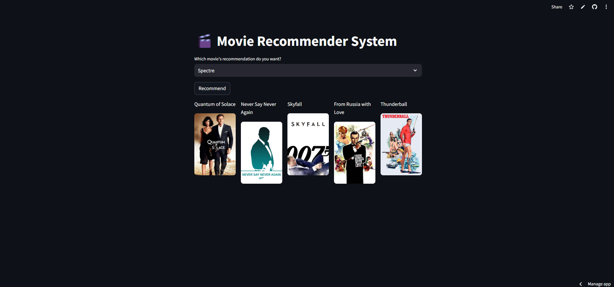

# 🎬 Movie Recommender System

This is a **Movie Recommendation System** built using **Streamlit** and **TMDb API**. The app suggests movies based on similarity scores and displays their posters. We are using TMDB dataset.
- Dataset used here are TMDB-5000 movie and credits csv.

# App Image


# Live Demo
[](https://8ozcudekug3fhodqgjdxhy.streamlit.app/)

## 🚀 Features
- Search for a movie and get recommendations.
- Displays movie posters along with recommendations.
- Uses **TMDb API** to fetch movie details.
- Top 5 movies which are similar to the required movie have been recommended here.
- Hosted on **Streamlit Cloud**.

## 📂 Files & Directories
- `app.py` → Main application file.
- `movie_dict.pkl` → Contains movie data.
- `similarity_compressed.pkl` → Precomputed similarity scores.
- `requirements.txt` → Dependencies for the app.
- `setup.sh` → Configures Streamlit Cloud.
- `Procfile` → For deployment on Streamlit Cloud.
- `Hosted Platform` → Streamlit Cloud
## 🔧 Installation & Setup
1. Clone the repository:
   ```sh
   git clone https://github.com/Prab1421/movie-recommender-system.git
   cd movie-recommender-system
   ```

2. Create a virtual environment:
   ```sh
   python -m venv .venv
   virtual environment has all the required package.
   source .venv/bin/activate  # On Windows: .venv\Scripts\activate
   ```

3. Install dependencies:
   ```sh
   pip install -r requirements.txt
   ```

4. Run the application locally:
   ```sh
   streamlit run app.py
   ```

## ☁️ Deployment on Streamlit Cloud
1. Upload the project to **GitHub**.
2. Create a new Streamlit Cloud app and link your GitHub repository.
3. Set up `Procfile`, `setup.sh`, and `requirements.txt` as needed.
4. Deploy the app and enjoy!

## 🛠️ Technologies Used
- **Python**
- **Streamlit**
- **Pandas & NumPy**
- **TMDb API**
- **Pickle** for storing precomputed similarity scores
- **Pickle** for storing precomputed similarity scores

---
🚀 **Enjoy Movie Recommendations!** 🎥🍿
